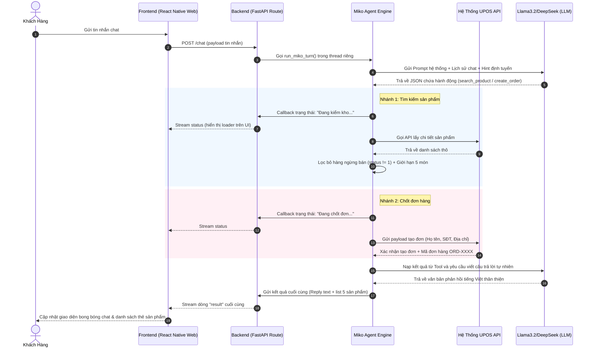

# 🤖 Miko AI Retail Sales Agent

Miko là một Trợ lý AI Tư vấn Bán hàng thông minh dành cho các cửa hàng bán lẻ và mỹ phẩm. Hệ thống được tích hợp trực tiếp dữ liệu kho sản phẩm và hệ thống lên đơn của **UPOS API**, cho phép tự động tư vấn sản phẩm, kiểm tra tồn kho theo trạng thái thực tế và chốt đơn tự động bằng giọng văn tự nhiên, thân thiện.

---

## 🛠️ Công Nghệ Sử Dụng (Technology Stack)

Hệ thống được thiết kế theo mô hình **Client-Server độc lập** kết hợp AI Agent Engine:

### 1. Frontend (Giao Diện Chat & Quản Lý)
* **Framework:** React Native Web (chạy trên nền **Vite** để tối ưu hóa hiệu năng HMR & tốc độ tải trang).
* **Kiến Trúc Component:** Module hóa rõ ràng:
  * [App.jsx](file:///d:/Developments/AgentDefinitions/FE/src/App.jsx): Trực quan hóa layout chính, xử lý khóa cứng viewport (docked header & input bar) chống tràn trang.
  * [ProductCard.jsx](file:///d:/Developments/AgentDefinitions/FE/src/components/ProductCard.jsx): Hiển thị thông tin sản phẩm, giá bán (format tiền tệ), hỗ trợ Line Clamp (max 2 dòng) tránh lỗi vỡ giao diện.
  * [ProductCarousel.jsx](file:///d:/Developments/AgentDefinitions/FE/src/components/ProductCarousel.jsx): Băng chuyền cuộn ngang mượt mà, hỗ trợ thanh cuộn trực quan trên Web desktop.
  * [ModelSelector.jsx](file:///d:/Developments/AgentDefinitions/FE/src/components/ModelSelector.jsx): Dropdown pill cho phép Switch nóng cấu hình LLM (Ollama / DeepSeek / NVIDIA Cloud NIM).
* **Custom Hook:** [useMikoChat.js](file:///d:/Developments/AgentDefinitions/FE/src/hooks/useMikoChat.js) tách biệt state engine, đọc dữ liệu Stream (NDJSON) thời gian thực và đồng bộ API URL theo IP LAN (`window.location.hostname`).

### 2. Backend (API & Điều Phối Agent)
* **Framework:** **FastAPI** (Python 3.10+) mang lại hiệu năng cao và khả năng hỗ trợ async cực tốt.
* **Cơ Chế Stream Trạng Thế (Real-time Status Steps):** 
  * Endpoint `/chat` trong [chat.py](file:///d:/Developments/AgentDefinitions/BE/routes/chat.py) sử dụng `StreamingResponse` (Newline-delimited JSON - `application/x-ndjson`).
  * Sử dụng luồng chạy ngầm (`threading.Thread`) kết hợp hàng đợi thread-safe `queue.Queue` để stream các bước Miko đang làm (Đang suy nghĩ... -> Đang gọi API... -> Đang đối chiếu...) về Frontend ngay lập tức.
* **Định tuyến Intent tự động (Dynamic Routing Hint):**
  * Hàm `get_hint` phân loại nhanh nội dung chat của khách để gán gợi ý bắt buộc cho LLM (chào hỏi ngắn, tìm kiếm sản phẩm, chốt đơn có thông tin, chốt đơn thiếu thông tin), tối ưu hóa tốc độ và độ chính xác của Llama 3.2 3B mà không làm mất tính linh hoạt.

### 3. Tích Hợp API Kho Hàng UPOS
* **Xác Thực (Auth):** [upos_auth.py](file:///d:/Developments/AgentDefinitions/BE/services/upos_auth.py) quản lý JWT Token. Có cơ chế tự động bắt lỗi HTTP 500/401 khi token hết hạn để tự động Re-login và Retry request ngay lập tức mà không làm gián đoạn cuộc hội thoại.
* **Kho Sản Phẩm:** [upos_products.py](file:///d:/Developments/AgentDefinitions/BE/services/upos_products.py) tự động truy vấn thông tin tất cả sản phẩm, tự động lọc bỏ các sản phẩm đã ngừng bán (`status != "1"`) và giới hạn trả về tối đa **5 sản phẩm** để tránh làm tràn giao diện.
* **Lên Đơn Hàng:** [upos_orders.py](file:///d:/Developments/AgentDefinitions/BE/services/upos_orders.py) chịu trách nhiệm validate thông tin (Họ tên, SĐT 10 số đầu 03-09, độ dài địa chỉ) và gửi yêu cầu tạo đơn hàng lên hệ thống UPOS.

---

## 📐 Kiến Trúc Hoạt Động (Architecture Diagram)



---

## 🔄 Luồng Trải Nghiệm Khách Hàng (User Flow)

Dưới đây là 4 luồng trải nghiệm khách hàng chính được điều phối bởi Agent:

### Luồng 1: Chào Hỏi & Tư Vấn Tự Do (Chế độ 1)
* **Ý định:** Khách chào hỏi xã giao hoặc hỏi han những câu hỏi không liên quan đến mua bán cụ thể.
* **Hành vi Agent:** Giao tiếp tự nhiên, thân thiện với vai trò là nhân viên tư vấn Miko, giới thiệu qua về shop và các mặt hàng kinh doanh.

### Luồng 2: Tra Cứu Sản Phẩm & Hiển Thị Thẻ (Chế độ 2)
* **Ý định:** Khách hỏi về một mặt hàng (ví dụ: *"shop mình có áo hoodie không?"*).
* **Hành vi Agent:** 
  1. Frontend hiển thị trạng thái `Miko đang suy nghĩ...` rồi chuyển thành `Đang kết nối API và kiểm tra kho hàng...`.
  2. Backend gọi API UPOS để lấy dữ liệu, lọc bỏ các sản phẩm ngưng bán, chỉ giữ lại các sản phẩm hoạt động (`status == "1"`).
  3. Trả về text tư vấn kèm tối đa 5 thẻ sản phẩm nằm trong băng chuyền (Carousel) cuộn ngang có thanh cuộn mượt mà trên Web.

### Luồng 3: Khách Bấm Nút Chốt Nhanh Nhưng Chưa Đủ Thông Tin Liên Hệ
* **Ý định:** Khách bấm nút **"chốt sản phẩm này"** trên thẻ sản phẩm. Frontend gửi tin nhắn dạng `"chốt [Tên sản phẩm]"`.
* **Hành vi Agent:**
  1. `get_hint` phát hiện từ khóa `"chốt"` nhưng không có SĐT hay địa chỉ giao hàng.
  2. Ép Miko trò chuyện tự do ở Chế độ 1 để cảm ơn khách và hỏi khéo thông tin giao hàng:
     > *"Dạ em cảm ơn chị đã chốt chiếc Áo Hoodie này ạ! Chị cho em xin Họ tên, Số điện thoại và Địa chỉ nhận hàng để em lên đơn ngay cho mình nha! 💕"*

### Luồng 4: Khách Cung Cấp Thông Tin & Lên Đơn Thành Công
* **Ý định:** Khách gửi tin nhắn chứa thông tin liên hệ (Số điện thoại 10 số, địa chỉ, họ tên...).
* **Hành vi Agent:**
  1. `get_hint` quét regex thấy định dạng SĐT Việt Nam -> Bắt buộc LLM phải gọi tool `create_order`.
  2. Backend tiến hành validate thông tin. Nếu hợp lệ, hệ thống sẽ chốt đơn trên UPOS và trả về mã đơn hàng (ví dụ: `ORD-MOCK-1008`).
  3. Miko thông báo chốt đơn thành công kèm chi tiết thông tin giao nhận để khách hàng kiểm tra lại.

---

## 🚀 Hướng Dẫn Khởi Chạy (Getting Started)

Dự án cung cấp một file launcher tự động [run.py](file:///d:/Developments/AgentDefinitions/run.py) để chạy đồng thời cả Backend và Frontend chỉ bằng một câu lệnh duy nhất:

### Bước 1: Cài đặt thư viện
* **Backend:**
  ```bash
  cd BE
  pip install -r requirements.txt
  ```
* **Frontend:**
  ```bash
  cd FE
  npm install
  ```

### Bước 2: Chạy hệ thống ở chế độ Demo LAN
Tại thư mục gốc của dự án, chạy lệnh:
```bash
python run.py
```

### Bước 3: Truy cập thiết bị
Launcher sẽ tự động phát hiện IP máy tính của bạn trong mạng LAN (ví dụ: `192.168.1.50`) và hiển thị các đường link truy cập:
* **Máy tính cá nhân (Local PC):** `http://localhost:5173`
* **Điện thoại / Máy tính bảng demo:** `http://192.168.x.x:5173` (Các thiết bị kết nối chung Wifi với máy tính đều có thể truy cập thẳng vào giao diện chat này để test thực tế).
* **Tắt đồng thời cả 2 server:** Nhấn `Ctrl+C` tại terminal chạy `run.py`.
